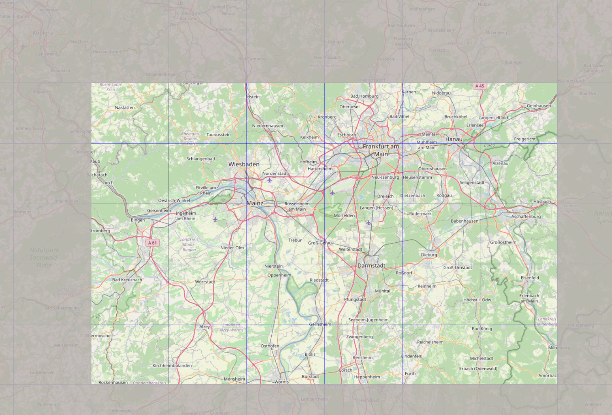

# Frankfurt
Custom scenery of Rheinhessen for FlightGear flight simulator

### This package contains:
* Frankfurt am Main Intl Airport (EDDF)
	* terrasync/custom objects
	* upgraded terrain around the aerodrome
	* many new secondary/cargo buildings
	* Terminal 3 WIP
	* new parking positios
	* FMS procedures for all runways (todo)
* Mainz Finthen (EDFZ)
	* custom main/secondary buildings
	* updated airport layout/runway config
	* new parking positions
	* FMS procedures
* Frankfurt Egelsbach (EDFE)
	* custom main/secondary objects
	* new parking positions
	* updated airport layout
* Wiesbaden AAF (ETOU)
	* shared objects
	* updated airport layout
* Hospital helipads
	* Frankfurt Uniklinik
	* Frankfurt Hoechst
	* Wiesbaden
	* Mainz
* All other small (closed) fields or gliderspots + osm2city in covered area:
    

### Requirements:

* latest set of shared objects:
	http://flightgear.sourceforge.net/scenery/Models/
        
### Data sources:

* SRTM-3 global elevation data:
	http://viewfinderpanoramas.org/Coverage%20map%20viewfinderpanoramas_org3.htm
* CORINE landcover data:
	https://land.copernicus.eu/pan-european/corine-land-cover/clc2018?tab=mapview
* OSM landmass data:
	https://osmdata.openstreetmap.de/data/land-polygons.html
* x-Plane detailed airports:
	https://gateway.x-plane.com
* FlightGear terrasync objects:
	https://scenery.flightgear.org/
* FMS-procedures hosted by pinto:
	https://github.com/l0k1/fg-navaiddata
* osm2city:
	https://gitlab.com/osm2city
* osm raw data:
	https://download.geofabrik.de/

### More useful links:

* FlightGear wiki:
	https://wiki.flightgear.org/Frankfurt_am_Main_Airport
* Frankfurt-Hahn custom scenery:
	https://github.com/D-Sven/Frankfurt-Hahn

### Special thanks to:

* D-ECHO
* d-laser (https://github.com/mherweg/d-laser-fgtools)
    

### Developers:

* D-SVEN

Sven Seipp, Dec 2021
